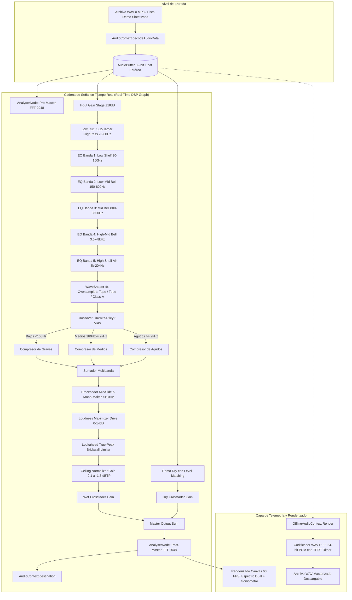
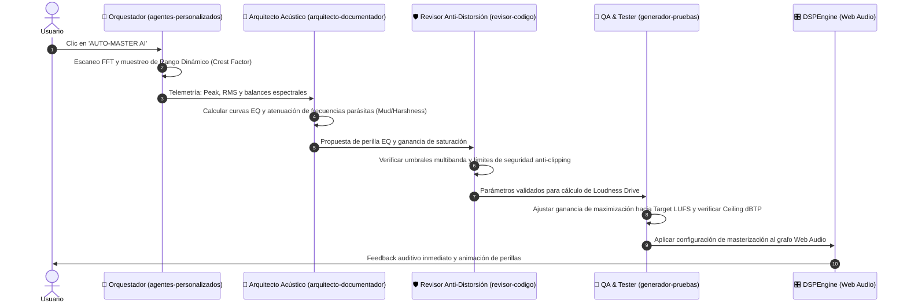

# Especificación de Arquitectura de Audio DSP: AUTOMASTER SUPREME

> **Autor**: Subagente `arquitecto-documentador.md`  
> **Sistema**: AUTOMASTER SUPREME VST AI Mastering Suite  
> **Motor**: Web Audio API 64-bit Floating-Point DSP / OfflineAudioContext 32-bit Float Render

---

## 1. Visión General del Sistema

**AUTOMASTER SUPREME** es una estación de trabajo y plugin de masterización con inteligencia artificial que procesa señales de audio estéreo ya mezcladas (WAV / MP3) para elevar su volumen comercial competitivo, ensanchar el campo estéreo con control de fase mono en graves, aplicar ecualización correctiva y tonal, introducir armónicos analógicos cálidos y maximizar el techo con limitación True-Peak transparente.

---

## 2. Especificación de los Módulos DSP

### 2.1. Entrada y Filtro Sub-Tamer (High-Pass)
- **Rango**: 20 Hz a 80 Hz, $Q = 0.707$ (Butterworth de 2º orden).
- **Objetivo**: Eliminar sub-frecuencias inaudibles por debajo de 30Hz que consumen margen dinámico (*headroom*) del limitador y provocan sobre-excursión en woofers.

### 2.2. Ecualizador Paramétrico de 5 Bandas
Filtros biquad de fase mínima con modulación suave de coeficientes:
1. **Low Shelf**: Graves profundos (30–150 Hz, $\pm 12$ dB).
2. **Low-Mid Bell**: Control de "caja" o resonancia turbia (150–800 Hz, $Q = 0.5 - 5.0$, $\pm 9$ dB).
3. **Mid Bell**: Presencia de voces e instrumentos líderes (800–3500 Hz, $Q = 0.5 - 5.0$, $\pm 9$ dB).
4. **High-Mid Bell**: Brillo y ataque de caja/platos (3500–8000 Hz, $Q = 0.5 - 5.0$, $\pm 9$ dB).
5. **High Shelf (Air Sheen)**: Aire sedoso analógico (8000–20000 Hz, $\pm 12$ dB).

### 2.3. Generador de Armónicos y Saturación Analógica
Utiliza un `WaveShaperNode` con factor de sobremuestreo `4x` (*oversampling*) para evitar el aliasing digital reflejado:
- **Cinta Analógica (*Tape Warmth*)**:
  $$y(x) = \tanh(x \cdot (1 + 1.5 \cdot d)) + 0.12 \cdot w \cdot (x^2 - 0.25)$$
  donde $d$ es el valor de *Drive* y $w$ es el factor de *Warmth*.
- **Válvula Triodo (*Tube Saturation*)**:
  $$y(x) = \begin{cases} \frac{1 - e^{-x(1+2d)}}{1 - e^{-2}} + 0.15 w \sin(\pi x) & x \ge 0 \\ -\tanh(-x(1+1.2d)) + 0.15 w \sin(\pi x) & x < 0 \end{cases}$$
- **Clase A (*Class-A Exciter*)**:
  $$y(x) = \frac{2}{\pi} \arctan(x \cdot (1 + 2.2 d))$$

### 2.4. Dinámica Multibanda de 3 Vías
- **Divisor de Frecuencia (*Crossover*)**: Linkwitz-Riley aproximado de 24 dB/octava en 160 Hz y 4200 Hz.
- Cada banda cuenta con control de umbral (*Threshold*), relación (*Ratio*), ataque (*Attack*), relajación (*Release*) y ganancia de compensación (*Makeup Gain*).

### 2.5. Procesador Mid/Side e Imagen Estéreo
1. Matriz M/S:
   $$\text{Mid} = \frac{L + R}{2}, \quad \text{Side} = \frac{L - R}{2}$$
2. El canal *Side* atraviesa un filtro pasa-altos centrado en el parámetro `monoMakerFreq` (110 Hz por defecto), colapsando el subgrave a mono absoluto para compatibilidad con discotecas, sistemas 2.1 y prensado de vinilo.
3. El canal *Side* se escala por el multiplicador de anchura ($\text{width} = 0.5$ a $2.0$).
4. Reconstrucción estéreo:
   $$L_{\text{out}} = \text{Mid} + \text{Side}_{\text{proc}}, \quad R_{\text{out}} = \text{Mid} - \text{Side}_{\text{proc}}$$

### 2.6. Maximizador de Volumen y Limitador True-Peak
- Curva de compresión rápida con relación brickwall (20:1), tiempo de ataque ultra-rápido de 1ms y tiempo de relajación adaptativo (50ms a 150ms).
- Margen de techo (*Ceiling*) configurable de -0.1 dBTP a -1.5 dBTP para cumplimiento de normalización en Spotify, Apple Music, Tidal y YouTube.

---

## 3. Orquestación Multi-Agente en Runtime

---

## 4. Exportación Offline a 24-bit PCM Broadcast WAV

El proceso de renderizado offline no depende de la velocidad de reproducción del sistema:
- Crea una instancia de `OfflineAudioContext(2, totalSamples, sampleRate)`.
- Instancia réplicas exactas de los nodos de filtrado, saturación, crossover y limitación.
- Procesa el audio más rápido que el tiempo real a 64 bits de precisión de punto flotante.
- Codifica las muestras a 24-bit little-endian aplicando **Dither TPDF (Triangular Probability Density Function)** para neutralizar el ruido de cuantización digital.
- Genera un `Blob` de tipo `audio/wav` con cabecera estándar RIFF WAVE para descarga directa.
