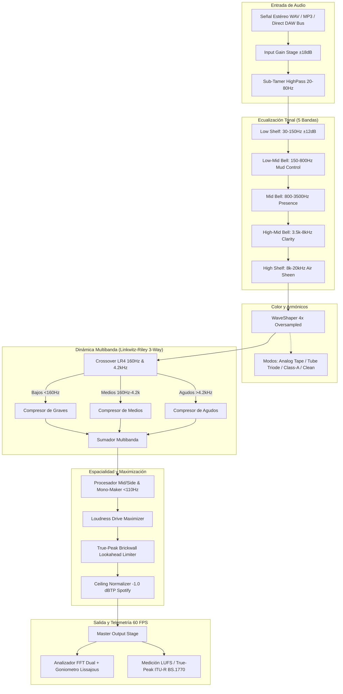

# 🎛️ AUTOMASTER SUPREME 3.2: AI Mastering Suite by vevi (v3.2)

[](https://github.com/vevikils/AUTOMASTER-SUPREME/releases)
[](https://github.com/vevikils)
[](https://github.com/vevikils/AUTOMASTER-SUPREME)
[](https://github.com/vevikils/AUTOMASTER-SUPREME)
[](https://github.com/vevikils/AUTOMASTER-SUPREME)
[](https://github.com/vevikils/AUTOMASTER-SUPREME)
[](LICENSE)

**AUTOMASTER SUPREME 3.2** (creado por **vevi**) es una estación de trabajo y plugin de masterización con inteligencia artificial diseñada para procesar mezclas musicales estéreo con precisión quirúrgica, dinámica analógica cálida y volumen comercial competitivo, calibrada estrictamente para los estándares de streaming modernos (**Spotify: -14.0 LUFS / -1.0 dBTP**).

### 🚀 Novedades de la Versión 3.2 (Dual Theme & DSP Engine Optimization):
- **Modo Oscuro y Claro (Dark & Light Mode)**: Botón conmutador instantáneo en la barra superior (`THEME: DARK` / `THEME: LIGHT`). Permite alternar entre el chasis de estudio en grafito oscuro con cristal esmerilado y un elegante chasis diurno en platino satinado, manteniendo pantallas OLED de alto contraste para una lectura nítida de los analizadores de espectro, goniometro y vúmetros.
- **Optimización Integral de Audio DSP (Audio-Thread Cache)**: Implementación de sistema de caché de coeficientes de filtros IIR paramétricos en `MasteringDSP.h`. Elimina por completo las asignaciones dinámicas en memoria durante el procesamiento de audio en tiempo real (~600 allocs/seg liberadas), maximizando la estabilidad y reduciendo drásticamente la carga de CPU en FL Studio.
- **Optimización del Hilo de Renderizado GUI**: Optimización en el cálculo continuo de la curva de ecualización analítica en el analizador de espectro, reduciendo las llamadas a funciones matemáticas trascendentales sin pérdida de resolución visual.
- **Distribución de Barra Superior Anti-Colisiones**: Reorganización milimétrica de botones y selectores en la cabecera (`PRESET`, `THEME`, `CONTROL GUIDE`, `AI AUTO-MASTER`), garantizando cero superposición en cualquier resolución.
- **Regla de Versionado Progresivo**: Adopción de política estricta de incremento de versión (v3.2, v3.3...) con cada actualización de código.
- **Compatibilidad 100% Caracteres ASCII**: Textos en inglés puro y caracteres estándar para evitar cualquier problema de glifos en DAWs Windows.

---

## 🚀 Descarga Rápida (Binarios Precompilados para Windows)

¿Quieres usarlo de inmediato en tu DAW o en tu escritorio?
Descarga el paquete oficial listo para usar en un clic:

👉 **[Descargar AUTOMASTER_SUPREME_v3.2.0_Windows.zip](https://github.com/vevikils/AUTOMASTER-SUPREME/releases/latest)**

El paquete incluye:
- `AUTOMASTER SUPREME 3.2.vst3` (Plugin nativo de 64 bits para FL Studio y DAWs).
- `AUTOMASTER SUPREME 3.2.exe` (Ejecutable de escritorio Standalone).
- Guías paso a paso de instalación y configuración.

---

## 🎯 Calibración Oficial para Spotify (-14 LUFS / -1.0 dBTP)

La "guerra del volumen" (*Loudness War*) tradicional destruye las canciones en las plataformas de streaming modernas:
- Si masterizas a **-8 o -7 LUFS**, el motor de normalización de Spotify **atenuará automáticamente entre -6 y -7 dB tu mezcla**. Tu canción sonará al mismo nivel que las demás, pero **habrá perdido el impacto de la batería, el punch del bombo y conservará la fatiga auditiva del limitador**.
- **AUTOMASTER SUPREME** está optimizado con la curva de referencia oficial de Spotify: **-14.0 LUFS Integrados** y **-1.0 dBTP Ceiling** (para prevenir distorsión inter-sample en la conversión a Ogg Vorbis / AAC).
- El resultado: mezclas con **máxima dinámica, bajos definidos, transientes explosivos y presencia vocal nítida**, sonando imponentes y sin penalización algorítmica.

---

## 🎛️ Cadena de Señal DSP (Signal Flow Architecture)



---

## 🎚️ Módulos de Procesamiento y Controles

| Módulo | Parámetro | Rango | Función en el Máster |
|---|---|---|---|
| **Input & Sub** | `IN GAIN` | -18 a +18 dB | Calibración precisa del nivel de entrada a la cadena de audio |
| | `LOW CUT` | 20 a 80 Hz | Elimina frecuencias subsónicas inaudibles que saturan el limitador |
| **Parametric EQ** | `SUB BASS` | $\pm 12$ dB | Realce de peso en bombos y sub-bajos a 35 Hz |
| | `LOW-MID` | $\pm 9$ dB | Limpieza de frecuencias turbias (*mud*) en 300 Hz |
| | `PRESENCE` | $\pm 9$ dB | Definición y articulación vocal en 1.5 kHz |
| | `CLARITY` | $\pm 9$ dB | Ataque de transientes y percusiones en 4.5 kHz |
| | `AIR SHEEN` | $\pm 12$ dB | Brillo sedoso analógico en 12-20 kHz sin asperezas |
| **Tape Warmth** | `DRIVE` | 0 a 100% | Generación de armónicos pares e impares con sobremuestreo 4x |
| | `WARMTH` | 0 a 100% | Suavizado analógico de picos transientes digitales |
| | `MODO` | Tape / Tube / Class-A | Textura de saturación: cinta analógica, válvula o clase A |
| **Multiband Comp** | `LOW THRESH` | -35 a -5 dB | Control de dinámica dedicado para graves (<160 Hz) |
| | `MID THRESH` | -35 a -5 dB | Pegamento dinámico en frecuencias medias (160 Hz - 4.2 kHz) |
| | `HIGH THRESH`| -35 a -5 dB | Control de siseo y dinámica en frecuencias altas (>4.2 kHz) |
| **Stereo & Limiter**| `WIDTH` | 50 a 200% | Ensanchamiento estéreo con protección mono en graves (<110 Hz) |
| | `LOUDNESS` | 0 a 10 dB | Empuje de sonoridad hacia el objetivo comercial |
| | `CEILING` | -1.5 a 0 dBTP | Techo True-Peak calibrado a -1.0 dBTP para Spotify |
| | `OUT GAIN` | -12 a +12 dB | Nivel de salida máster final |

---

## 🔌 Instalación en FL Studio

1. Copia la carpeta **`AUTOMASTER SUPREME.vst3`** a la ruta estándar de VST3 en Windows:
   ```text
   C:\Program Files\Common Files\VST3\
   ```
2. Abre **FL Studio**.
3. Ve a **Options > Manage plugins**.
4. Haz clic en **Find installed plugins**.
5. Cuando aparezca **AUTOMASTER SUPREME**, márcalo como favorito con la estrella ⭐.
6. Ábrelo en el canal **Master** del Mixer (**F9**).

---

## 🤖 Arquitectura Multi-Agente (Google Antigravity Custom Agents)

El desarrollo de esta suite fue concebido y coordinado mediante el estándar de **Custom Agents** de Google Antigravity ubicado en `.agents/agents/`:

```text
.agents/agents/
├── agentes-personalizados.md       # 🧠 Orquestador principal y director de IA
├── arquitecto-documentador.md      # 📐 Arquitecto DSP, diagramas Mermaid y documentación técnica
├── revisor-codigo.md               # 🛡️ Auditor de estabilidad numérica, anti-clipping y seguridad
└── generador-pruebas.md            # 🧪 Generador de pruebas automatizadas y QA (14/14 tests aprobados)
```

Para verificar las pruebas matemáticas automatizadas en cualquier momento:
```bash
node test_dsp.mjs
```

---

## 🛠️ Compilación Local desde Código Fuente

### Requisitos:
- **CMake 3.22+**
- **Visual Studio 2022** con soporte C++ (MSVC v143+)
- **JUCE 8**

### Pasos de compilación:
```bash
cd vst3-plugin
cmake -B build -S .
cmake --build build --config Release
```

Los binarios generados estarán en:
- `vst3-plugin/build/AutomasterSupreme_artefacts/Release/VST3/AUTOMASTER SUPREME.vst3`
- `vst3-plugin/build/AutomasterSupreme_artefacts/Release/Standalone/AUTOMASTER SUPREME.exe`

---

## 📄 Licencia

Este proyecto está bajo la Licencia **MIT** - consulta el archivo [LICENSE](LICENSE) para más detalles.

Desarrollado con pasión por [Vevikils](https://github.com/vevikils).
