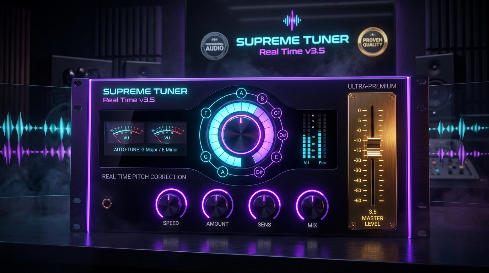

# 🎤 SUPREME TUNER Real Time v3.9: Hybrid Hardware Master Edition
### 👑 Autor: **vevi** (@vevikils)

<p align="center">
  
</p>

<p align="center">
  <a href="https://github.com/vevikils/AUTOMASTER-SUPREME"></a>
  <a href="https://github.com/vevikils"></a>
  
  
  
  
</p>

---

## 🌟 Descripción General

**SUPREME TUNER Real Time v3.9**, creado por **vevi**, es la edición definitiva del afinador vocal en tiempo real de ultra-baja latencia (< 2.9 ms). Integra un diseño de consola analógica de alta fidelidad, paleta de color dual con acentos violeta neón y oro 24K, fondo con textura de titanio y fibra de carbono al 20% de opacidad, placas de hardware dedicadas para los faders de dinámica, y un fader master profesional calibrado de -24 dB a +6 dB.

Supervisada en geometría y acabado por el subagente de IA especializada **`experto-gui-vision`** (`gemini-3`):
- **Fondos de Consola Dedicados para Faders de Dinámica**: Placas fresadas de titanio y obsidiana con 4 micro tornillos hexagonales, ranura vertical iluminada con línea láser violeta, y escala serigrafiada de +12 a -12 dB (Transientes) y 100% a 0% (Compresión).
- **Fader Master en Oro Macizo 24K Calibrado (-24 dB a +6 dB)**: Rango analógico profesional con unidad a 0 dB, placa rehundida de oro macizo y rótulo oficial `3.9 MASTER LEVEL • BY VEVI`.
- **Círculos en Violeta Neón**: Todos los mandos rotatorios, arcos iluminados, halos ambientales y joyas centrales en violeta eléctrico (`#a855f7` / `#d8b4fe`), conservando el tono dorado/ámbar en la sección Master.
- **Fondo con Textura Cyberpunk al 20% de Opacidad**: Chasis de titanio cepillado, fibra de carbono y ondas de audio sutilmente integradas en el lienzo de 1250x840 px.
- **52 Presets de Artistas & Cero Colisiones**: T-Pain, Travis Scott, Bad Bunny, Drake, Feid, Rosalia, Mora, etc.

---

## 🎛️ Arquitectura de la Versión 3.9

### 1. 📻 Búmetros Analógicos Dobles de Estudio
- Integrados en el módulo Master (Unit 4) con ventana de cristal acrílico rehundida.
- Diales curvados con retroiluminación ámbar incandescente (`#301807` a `#140903`) y escala serigrafiada de -20 a +3 dB.
- Balística mecánica analógica de respuesta rápida con tiempo de integración estándar VU de 300 ms.
- Display digital interior sincronizado en tiempo real con la tonalidad y escala seleccionadas (`AUTO-TUNE: [KEY] [SCALE]`).

### 2. 🏆 Fader Master de Consola en Oro Cepillado 24K
- Placa maciza de oro con acabado cepillado vertical y 4 tornillos dorados de fijación.
- Ranura central empotrada con escala serigrafiada de decibelios (+6 a -24 dB).
- Tirador de consola en oro 24K con estrías táctiles y muesca iluminada en blanco brillante.
- Rótulo grabado en bronce: `3.9 MASTER LEVEL • BY VEVI`.

### 3. 🎚️ 4 Racks Modulares de Estudio Analógico (v3.5)
- **Unit 1: NOISE GATE & DYNAMICS**:
  - Controles rotatorios Fruity Limiter: `GATE THRESH` (-80 a 0 dB) y `RELEASE` (10 a 1000 ms).
  - Faders verticales dedicados: `TRANSIENTS` (-12 a +12 dB) y `COMPRESSION` (0 a 100%).
- **Unit 2: VOCAL TONE ENGINE**:
  - `AIR 12kHz` (-12 a +12 dB) para brillo sedoso de condensador a válvulas.
  - `BODY 250Hz` (-12 a +12 dB) para peso y cuerpo vocal.
  - `WARMTH / DRIVE` para saturación armónica analógica.
- **Unit 3: SPACE & AMBIENCE**:
  - `VOCAL SPACE` (Reverb Mix & Room Size) con amortiguación HF.
  - `STEREO ECHO` (Delay Mix, Delay Time sincronizado y Feedback ping-pong).
- **Unit 4: GAIN STAGING & MASTER**:
  - `STEREO WIDTH` (0% a 200%) y `DRY / WET` de mezcla vocal.
  - Placa y Fader de Oro 24K.
  - Insignia interactiva `[ANALOG SATURATION: ACTIVE]`.

### 4. 🎡 Rueda Cromática Antares & Pitch Quantize (v3.5)
- Esfera central con orbe de vidrio líquido, aguja láser reflectante y 12 nodos de notas musicales iluminados según escala y raíz.
- Retune Speed ultrarrápido (0.0 ms Hard Snap clásico) con insignia `[T-PAIN HARD SNAP: ACTIVE]`.
- Módulo Glide & Vibrato (Glide Time, Vibrato Depth, Rate).

---

## 🎨 Banco de 52 Presets de Artistas

| Categoría | Presets Incluidos |
|---|---|
| **Leyendas del Autotune** | *T-Pain - Buy U a Drank (Hard Snap)*, *Travis Scott - Sicko Mode*, *Drake - God's Plan*, *Bad Bunny - Tití Me Preguntó*, *Rosalía - Motomami Snappy*, *The Weeknd - Blinding Lights 80s*, *Kanye - Heartless (808s)*, *Post Malone - Circles*, *Billie Eilish - Ocean Eyes*, *Juice WRLD - Lucid Dreams* |
| **Urbano Latino & Trap** | *Rauw Alejandro - Todo De Ti*, *Feid - Feliz Cumpleaños Ferxxo*, *Mora - Memorias*, *Anuel AA - Real Hasta La Muerte*, *Karol G - Provenza*, *Bizarrap - Music Sessions*, *Duki - Goteo Trap*, *Trueno - Dance Crip*, *Eladio Carrión - Mbappé*, *Young Miko - Lisa Snappy* |
| **Rage & Hyperpop** | *Lil Uzi Vert - Just Wanna Rock*, *Playboi Carti - Magnolia*, *Yeat - Monëy so big*, *Peso Pluma - Ella Baila Sola*, *Natanael Cano - Pacas De Billetes*, *Fuerza Regida - Bebe Dame*, *Charli XCX - Von Dutch*, *glaive - astrid Digicore*, *Sophie - Immaterial Glitch* |
| **R&B, Soul & Pop** | *SZA - Kill Bill*, *Ariana Grande - 7 Rings*, *Frank Ocean - Nights*, *Tyler The Creator - Earfquake*, *Giveon - Heartbreak Anniversary*, *Kali Uchis - Telepatía*, *Justin Bieber - Peaches* |
| **Estudio FX & Filtros** | *Vintage Telephone (AM Bandpass)*, *Megaphone Lo-Fi Distortion*, *Underwater Sub Voicing*, *Radio FM Broadcast Drive*, *Space Astronaut Comm Link*, *Daft Punk Robotic Vocoder*, *Cybernetic Android AI*, *Ambient Cloud Reverb*, *Slapback Echo 50s*, *Doubler Stereo Widener*, *Octave Sub Heavy Pitch*, *Whisper Plate Vocals* |

---

## 💻 Instalación Rápida

### VST3 (DAWs: FL Studio, Ableton, Reaper, Cubase, Studio One)
Copia la carpeta `Supreme Tuner Real Time v3.6.vst3` en tu directorio estándar VST3 de Windows:
```
C:\Program Files\Common Files\VST3\Supreme Tuner Real Time v3.6.vst3
```

### Standalone (Ejecutable de Escritorio)
Ejecuta directamente:
```
Supreme Tuner Real Time v3.6.exe
```
Ideal para ensayos, directos con tarjeta de sonido USB/Thunderbolt y pruebas con latencia mínima sin necesidad de abrir un DAW.

---

## 🛠️ Compilación desde el Código Fuente

### Requisitos:
- **Visual Studio 2022** (MSVC v143 con soporte C++20).
- **CMake 3.22+**.
- **Windows 10 / 11 (64-bit)**.

```bash
# 1. Clonar repositorio
git clone https://github.com/vevikils/AUTOMASTER-SUPREME.git
cd AUTOMASTER-SUPREME/tpain-supreme

# 2. Generar solución con CMake
cmake -B build -G "Visual Studio 17 2022" -A x64

# 3. Compilar en modo Release
cmake --build build --config Release --parallel

# 4. O compilar y desplegar automáticamente con el script deploy.py
python deploy.py
```

### Suite de Tests de Estrés (12/12):
```bash
.\build\Release\StressTest.exe
```
Valida inmunidad contra NaN/Inf, sample rates de 8 kHz a 384 kHz, buffers variables, desconexiones en caliente de micrófonos, fuzzing a 5,000 bloques y ráfagas DC de +100 dBFS.

---

## 📜 Licencia
Distribuido bajo la licencia MIT. Creado con ❤️ por **vevi**.
